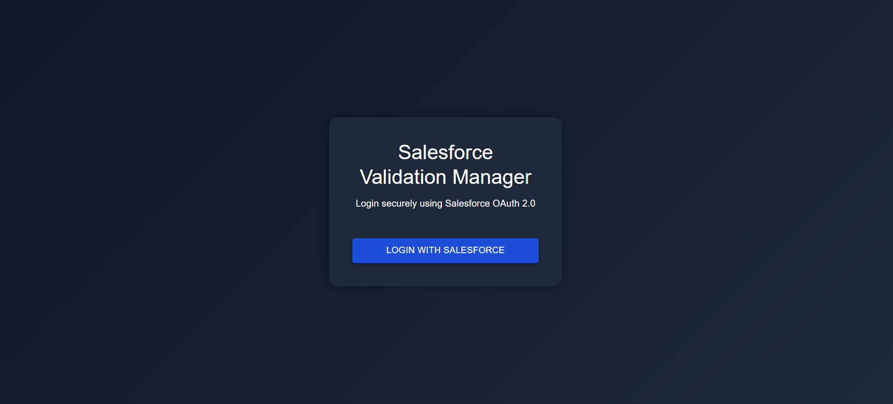
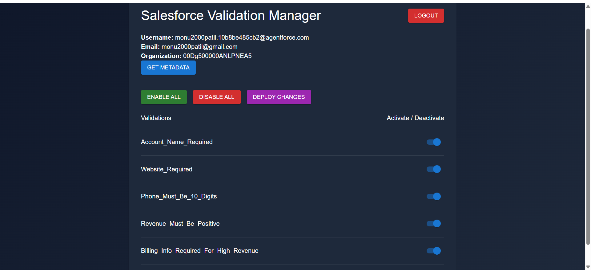
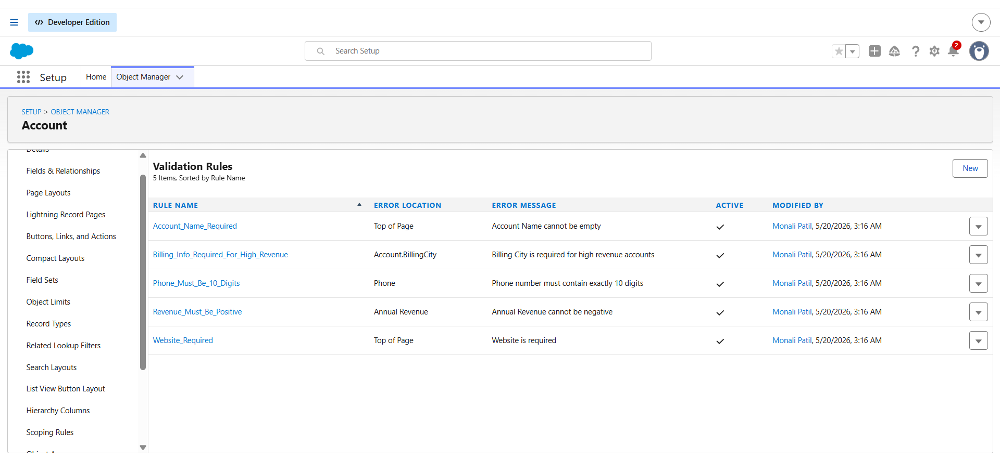

# Salesforce Validation Manager

A full-stack Salesforce metadata management application built using:

- React.js
- Node.js
- Express.js
- Salesforce OAuth 2.0
- Salesforce Tooling API

Features:
- Secure Salesforce Login
- Fetch Validation Rules
- Enable/Disable Rules
- Deploy Metadata Changes
- Responsive UI
- Hosted on Render

## Live Demo

https://sfswitch-4tts.onrender.com

## Screenshots
## Login Page

## Dashboard

##Validations

## Author

Monali Nalawade

